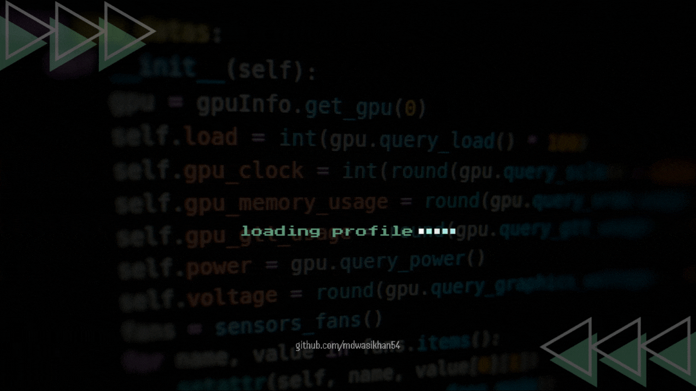

  

  

---

### 🧑‍💻 About Me
- 💬 Expertise: **Python, C++, Linux Internals & Backend Systems**
-  🎨 Frontend: **Building responsive UIs using HTML, CSS, Bootstrap & JS**
- 🔭 Focus: **Software Architecture & RESTful API Design**
- 🌍 Connect: **Open for collaborative development & tech networking**
- 🚀 Core Values: **Clean Code, Logic Optimization & Data Integrity**
- 🐧 Daily Driver: **Linux (Ubuntu) for development & deployment**
- 📚 Learning: **Advanced FastAPI patterns & PostgreSQL Tuning**
- ⚡ Fun fact: *Turning coffee into bug-free code*

---

### 🎖️ Certifications & Badges

  

<table align="center" border="0">
  <tr>
    <td align="center" width="120">
      
       
      <b>HackerRank</b>
    </td>
    <td align="left" width="400">
      <strong>🥇 C Programming (Gold Badge)</strong>
       
      Earned Gold Badge for solving challenges & mastering C logic.
    </td>
    <td align="center" width="150">
      
    </td>
  </tr>
  <tr>
    <td align="center" width="120">
      
       
      <b>HackerRank</b>
    </td>
    <td align="left" width="400">
      <strong>🥇 C++ Programming (Gold Badge)</strong>
       
      Achieved 5-star Gold status in Data Structures & Algorithms.
    </td>
    <td align="center" width="150">
      
    </td>
  </tr>
  <tr>
    <td align="center" width="120">
      
       
      <b>HackerRank</b>
    </td>
    <td align="left" width="400">
      <strong>📜 Python (Basic) Certificate</strong>
       
      Certified for demonstrating strong command over Python syntax & basics.
    </td>
    <td align="center" width="150">
      
    </td>
  </tr>
</table>

---
### 🛠 Languages and Tools

#### Programming Languages
<table>
  <tr>
    <td align="center" width="96">
       <b>C</b>
    </td>
    <td align="center" width="96">
       <b>C++</b>
    </td>
    <td align="center" width="96">
       <b>Python</b>
    </td>
    <td align="center" width="96">
       <b>JavaScript</b>
    </td>
  </tr>
</table>

#### Web & Frameworks
<table>
  <tr>
    <td align="center" width="96">
       <b>HTML</b>
    </td>
    <td align="center" width="96">
       <b>CSS</b>
    </td>
    <td align="center" width="96">
       <b>Bootstrap</b>
    </td>
    <td align="center" width="96">
       <b>Tailwind CSS</b>
    </td>
    <td align="center" width="96">
       <b>FastAPI</b>
    </td>
  </tr>
</table>

#### Databases & DevOps
<table>
  <tr>
    <td align="center" width="96">
       <b>PostgreSQL</b>
    </td>
    <td align="center" width="96">
       <b>Linux</b>
    </td>
    <td align="center" width="96">
       <b>Git</b>
    </td>
    <td align="center" width="96">
       <b>GitHub</b>
    </td>
    <td align="center" width="96">
       <b>GitLab</b>
    </td>
    <td align="center" width="96">
       <b>Docker</b>
    </td>
  </tr>
</table>

#### Testing & Editors
<table>
  <tr>
    <td align="center" width="96">
       <b>Postman</b>
    </td>
    <td align="center" width="96">
       <b>VS Code</b>
    </td>
  </tr>
</table>

#### Design & Productivity
<table>
  <tr>
    <td align="center" width="96">
       <b>Photoshop</b>
    </td>
    <td align="center" width="96">
       <b>Illustrator</b>
    </td>
    <td align="center" width="96">
      
       <b>Canva</b>
    </td>
    <td align="center" width="96">
       <b>CapCut</b>
    </td>
    <td align="center" width="96">
       <b>MS Word</b>
    </td>
    <td align="center" width="96">
       <b>MS Excel</b>
    </td>
  </tr>
  <tr>
    <td align="center" width="96">
       <b>MS PowerPoint</b>
    </td>
  </tr>
</table>

---
### 📊 GitHub Stats

  

  

  

---
### 🏆 GitHub Trophies

  

---
### 📈 Contribution Activity

  

---

### 🚀 Projects Showcase

#### 🎓 [Student Management API](https://github.com/mdwasikhan54/student-management-api)
> *A high-performance RESTful API backend with secure authentication.*

A production-ready backend system designed to manage student records securely. Built with FastAPI, it demonstrates modern API standards including strict validation, error handling, and a custom file-based database engine.

**Key Features:**
- **Secure Auth System**: User registration with duplicate checks and robust Bcrypt password hashing.
- **Smart Data Retrieval**: Implements efficient pagination, case-insensitive search, and filtering logic.
- **Robust Validation**: Utilises Pydantic V2 for strict data type enforcement and centralized error management.
- **Custom Persistence**: Lightweight, server-less JSON database architecture for high portability.

**Tech Stack:** Python 3.12+, FastAPI, Uvicorn, Pydantic, Passlib (Bcrypt)

[🔗 View on GitHub](https://github.com/mdwasikhan54/student-management-api)

 

#### 🏥 [Clinic Management System](https://github.com/mdwasikhan54/Clinic-Management-System)
> *A robust CLI-based system managing patient records and inventory without SQL.*

A CLI-based Clinic Management System built with Python using text files as a database. It manages patient queues, digital prescriptions, and pharmacy inventory.

**Key Features:**
- **Manager Module**: Serial management, queue control, inventory CRUD, sales reporting (daily logs, item-wise summaries, date filtering).
- **Doctor Module**: Live queue, digital prescriptions (auto-fetch patient info, dosage, duration, clinical tests), smart search by phone/Smart ID, prescription history.
- **Core Features**: Role-based security with password masking, Smart ID generation (e.g., `J0018`), persistent data storage via `.txt` files.

**Tech Stack:** Python 3, Flat file database, Libraries: `sys`, `os`, `datetime`, `random`, `string`, `getpass`

[🔗 View on GitHub](https://github.com/mdwasikhan54/Clinic-Management-System) | [📹 Demo Video](https://www.youtube.com/watch?v=F59Zkkpb-bM)

 

  

---
### 📫 Connect with Me
<table align="center">
  <tr align="center">
    <td width="80">
       <b>LinkedIn</b>
    </td>
    <td width="80">
       <b>Facebook</b>
    </td>
    <td width="80">
       <b>Instagram</b>
    </td>
    <td width="80">
       <b>X</b>
    </td>
    <td width="80">
       <b>WhatsApp</b>
    </td>
    <td width="80">
       <b>Gmail</b>
    </td>
  </tr>
</table>

---

### 📅 Last Updated

<em style="font-family: 'Courier New', monospace; font-size: 0.9em; color: #00BFFF; font-style: italic;">November 26, 2025, 06:30 PM +06</em>

---

<i><strong>"The only way to go fast, is to go well."</strong>– Robert C. Martin</i>

